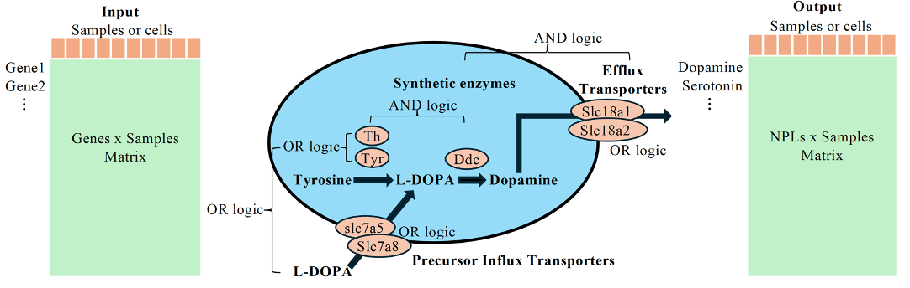
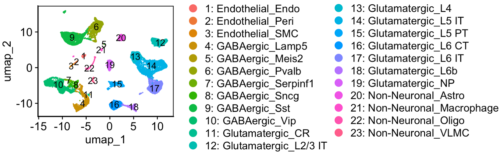
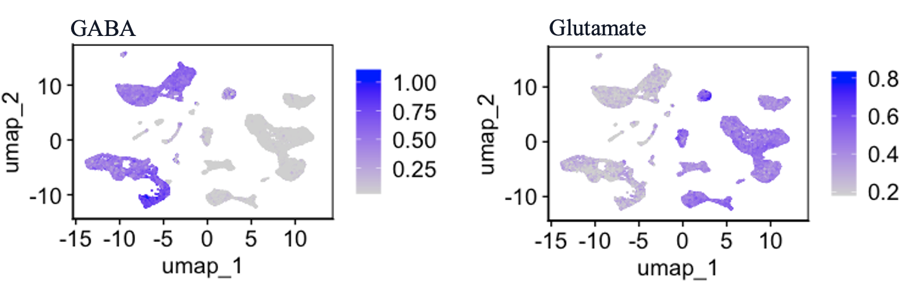

# MetaLigand

MetaLigand is a full-featured R package for estimating non-peptide ligands abundance from bulk & single-cell RNA-seq data.
(MetaLigand is currently in beta and will be in active development through the peer review process.)

<hr>

<div  align="center">

</div>

<hr>

## Quick Installation of MetaLigand

```{r}
# Install devtools
if (!requireNamespace("devtools", quietly = TRUE)) install.packages("devtools")

# Install required packages
install.packages(c('tidyverse','Seurat','ggplot2','pheatmap'))
BiocManager::install("scRecover")

# Install MetaLigand
devtools::install_github("https://github.com/jinyangye119/MetaLigand")
```

<hr>

## Learn to use MetaLigand

**load datasets and packages**
- List of NPLs and their associated synthetic and transporter genes were stored in .csv format under inst/extdata/
- List of datasets used in vignettes are availble under vignettes/

```{r}
library(tidyverse)
library(MetaLigand)
library(pheatmap)
library(Seurat)
library(scRecover)

```

**Testing MetaLigand on a single-cell RNA-seq dataset**
- A single-cell transcriptomic database of adult mouse visual cortex was used for testing (https://doi.org/10.1038/s41586-018-0654-5)
- Raw gene expression matrix and metadata were downloaded from GEO-GSE115746 and stored under vignettes/


```{r}
# Load VISP dataset
visp <- read.csv("vignettes/GSE115746_cells_exon_counts.csv.gz",header = T,row.names = 1)
visp_meta <- read.csv("vignettes/GSE115746_complete_metadata_28706-cells.csv.gz")%>%
  dplyr::filter(sample_name%in%colnames(Visp))%>%
  column_to_rownames("sample_name")
Visp <- Visp[,rownames(meta_visp)]

# Optional: data imputation
scRecover(counts = Visp, labels = meta_visp$cell_class, outputDir = "./outDir_scRecover/")
visp = read.csv ("./outDir_scRecover/scRecover+scImpute.csv")

```

```{r}
# This is standard Seurat pipeline, to visulize data before MetaLigand
# If you just want a NPL table, skip this step
Seurat<- CreateSeuratObject(
  counts = Visp,
  meta.data = meta_visp
)
Seurat <- NormalizeData(Seurat)
Seurat <- FindVariableFeatures(Seurat)
Seurat <- ScaleData(Seurat)
Seurat <- RunPCA(Seurat)
Seurat <- FindNeighbors(Seurat,reduction = "pca", dims = 1:30)
Seurat <- FindClusters(Seurat,reduction = "pca", resolution = 0.5)
Seurat <- RunUMAP(Seurat,reduction = "pca", dims = 1:30)
Seurat <- subset(Seurat,cell_subclass%in%c("","Batch Grouping","Doublet","High Intronic","No Class","Low Quality"),invert=T)
Seurat$new_group <- paste(Seurat$cell_class,Seurat$cell_subclass,sep = "_")
DimPlot(Seurat,group.by = "new_group",label = T)
```


<div  align="center">

</div>

```{r}
# Now we run MetaLigand
# Note that the input file should be normalized gene x Cell matrix from single-cell RNAseq, or normalized gene x sample matrix from bulk RNAseq.

# First extract normalized gene x cell matrix from seurat
sc_input = Seurat@assays$RNA@data%>%
  as.matrix()

# Generate NPL matrix
NPL_matrix = Meta_matrix(sc_input,
                        species = "mouse",
                        And_method = "gmean",
                        Or_method = "mean",)
NPL_matrix = NPL_matrix[rowSums(is.na(NPL_matrix))==0,]

```

```{r}
# Integrate NPL matrix into seurat object

Seurat_new = Seurat
NPL_assay = CreateAssayObject(data=NPL_matrix)

Seurat_new[["NPL_assay"]] = NPL_assay

# Visulize GABA and Glutamate on umap and violin plot
DefaultAssay(Seurat_new) <- "NPL_assay"
FeaturePlot(Seurat_new,features = c("L-Glutamic acid","gamma-Aminobutyric acid"),label = F,min.cutoff = "q10",ncol = 1)&
  ggplot2::theme(legend.position = "right",
                 panel.background  = element_rect(colour = "black", size=0.8),
                 text=element_text(size = 14),
                 axis.text = element_text(size = 14),
                 strip.text =element_text(size = 14),
                 legend.text = element_text(size=14,face = "plain"))
```


<div  align="center">

</div>

**Cell-cell communication**
```{r}

# Load NPL-R interactions
NPLRdb = read.csv("NPLRdb_human.csv")
NPLRdb = NPLRdb[,c("L", "R")]
# (optional) Load a peptide L-R interaction network, here we use the network used in the R package "LRLoop" as an example,
# the network matrix should have columns "L" and "R", ligands/receptors with multiple units should have the units conneted by ";" like "unitA;unitB;unitC".
PLRdb = read.csv("PLRdb_human.csv")
PLRdb = PLRdb[,c("L", "R")]
# Combine NPL and peptide LRs
NPLRdb$LType = "NPL"
PLRdb$LType = "PL"
LRdb = rbind.data.frame(NPLRdb, PLRdb)

# define sample conditions and cell-types/clusters in the columns "cond" and "cl" of the meta.data
Seurat_new$cl = Seurat_new$new_group
Seurat_new$cond = Seurat_new$donor_sex

# Get detection rates and average NPL and gene levels
exprinfo = getExprInfo(Seurat_new)

# Get interaction scores of all LR pairs for all pairs of cell-types/clusters in each sample condition
# Remark; can be time consuming when there are many cell-types/clusters
SLRIlist = getLRIScore(lr_network = LRdb, exprinfo = exprinfo, LRI.method = "scsigr")

# For a particular cell type/cluster-pair and sample condition of interest, get the interaction scores and p-values (generated by permutations).
mySLRI = getLRIpval(seuratobj = Seurat_new, lr_network = LRdb, 
                    cl_from = "GABAergic_Lamp5", cl_to = "GABAergic_Vip", cond = "F", 
                    avgexprall = exprinfo$avgexprall, LRI.method = "scsigr", numperm = 100)


```

<hr>

## Issues using MetaLigand?

MetaLigand is currently in __beta__. If you think you have found a bug, please [report an issue on Github](https://github.com/jinyangye119/MetaLigand/issues) with the __Bug Report__ form.
