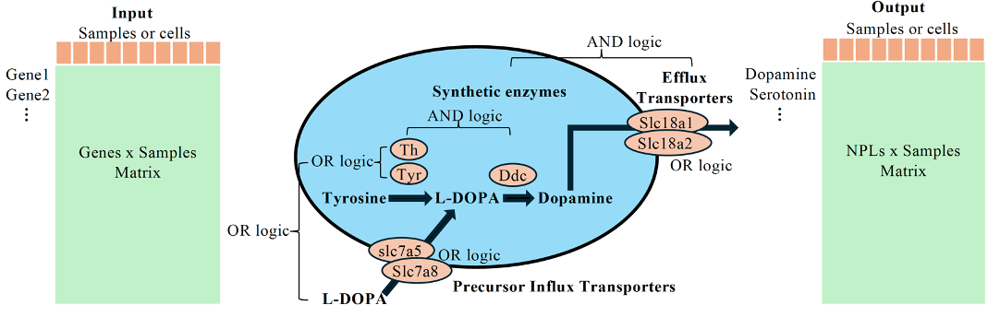

# MetaLigand

MetaLigand is an R package for estimating non-peptide ligand (NPL) activity
from bulk and single-cell transcriptomic data. It combines curated synthesis,
transporter, precursor-transport, and receptor gene sets to infer metabolite- and
lipid-related signaling programs that are not captured by peptide-only
ligand-receptor databases.

MetaLigand is in active development and should currently be treated as a beta
research package.

<hr>

<div align="center">

</div>

<hr>

## Installation

```r
install.packages("remotes")
remotes::install_github("jinyangye119/MetaLigand")
```

Common analysis dependencies:

```r
install.packages(c("dplyr", "ggplot2", "pheatmap", "Seurat"))
```

## Main Features

- Estimate NPL activity matrices from normalized gene-expression matrices.
- Support human, mouse, and zebrafish ligand databases.
- Integrate inferred NPL activity into Seurat objects as a separate assay.
- Score NPL-receptor and peptide ligand-receptor interactions across cell
  groups and sample conditions.
- Run permutation-based p-value estimation for selected sender-receiver pairs.

## Quick Start

```r
library(MetaLigand)

# Normalized gene x cell or gene x sample matrix with gene symbols as row names.
npl_matrix <- Meta_matrix(
  ave_expr = normalized_expression,
  species = "mouse",
  And_method = "gmean",
  Or_method = "mean"
)

npl_matrix <- npl_matrix[rowSums(is.na(npl_matrix)) == 0, , drop = FALSE]
```

## Seurat Integration

```r
library(Seurat)

seurat_obj[["NPL_assay"]] <- CreateAssayObject(data = npl_matrix)
DefaultAssay(seurat_obj) <- "NPL_assay"

FeaturePlot(
  seurat_obj,
  features = c("L-Glutamic acid", "gamma-Aminobutyric acid")
)
```

## Cell-Cell Communication Workflow

MetaLigand expects cell-type and condition labels in `seurat_obj@meta.data`:

```r
seurat_obj$cl <- seurat_obj$cell_type
seurat_obj$cond <- seurat_obj$condition

exprinfo <- getExprInfo(seurat_obj)
```

Load or construct a ligand-receptor network with columns `L` and `R`, where
multi-subunit ligands or receptors use semicolon-separated gene symbols:

```r
nplr_db <- read.csv(system.file("extdata", "NPLRdb_human.csv", package = "MetaLigand"))
nplr_db <- nplr_db[, c("L", "R")]

score_list <- getLRIScore(
  lr_network = nplr_db,
  exprinfo = exprinfo,
  LRI.method = "scsigr"
)
```

For a selected sender-receiver pair and condition:

```r
pval_table <- getLRIpval(
  seuratobj = seurat_obj,
  lr_network = nplr_db,
  cl_from = "GABAergic_Lamp5",
  cl_to = "GABAergic_Vip",
  cond = "F",
  avgexprall = exprinfo$avgexprall,
  LRI.method = "scsigr",
  numperm = 100
)
```

## Repository Contents

```text
R/                 # Package functions
inst/extdata/      # Curated NPL, receptor, synthesis, and transporter tables
Figures/           # Workflow and example figures
vignettes/         # Example metadata used in development
shiny/             # Prototype Shiny app files
```

## Notes

- Input expression should be normalized before calling `Meta_matrix()`.
- Row names must be gene symbols matching the selected species database.
- Increase `numperm` for publication analysis and set a random seed before
  permutation workflows.
- Please open an issue if you find a bug or have a use case that is not covered
  by the current beta API.
